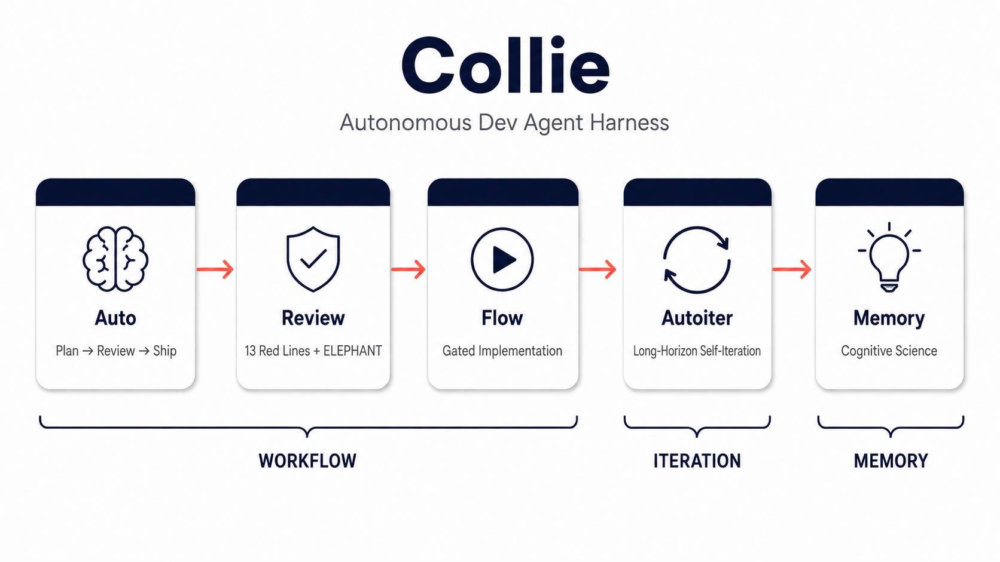

# Collie



Claude Code plugin that enforces a complete development workflow — brainstorm, plan, dual-review, gated implementation, rubric code review — with hooks that make every step non-optional.

## What is Collie

Five capabilities working together:

| Capability | Entry point | What it does |
|------------|-------------|-------------|
| **auto** | `/collie:auto` | End-to-end feature development: research → brainstorm → plan → review → implement → ship |
| **flow** | `collie:flow` | Post-planmode gated implementation with worktree isolation, TDD, code review, and pre-merge rubric gate |
| **review** | `collie:review` | 13 red-line rubric + 6 design questions + ELEPHANT anti-sycophancy check + Reflexion grounding |
| **autoiter** | `/collie:autoiter` | Self-iterating fix loop: run → observe → triage → deep-verify → fix → rerun, with overfit guards |
| **memory** | `collie:memory` | Boids-inspired memory system: decision tree evaluates what to remember, consolidation merges over time |

## Quick Start

### Prerequisites

```bash
/plugin install superpowers@claude-plugins-official
/plugin install ralph-loop@claude-plugins-official
```

Verify: `/plugin list` should show both `superpowers` and `ralph-loop`.

### Install

```bash
claude plugin marketplace add lkv1988/collie-harness
claude plugin install collie@collie-marketplace
```

### Configure

Add to `~/.claude/settings.json`:

```json
"permissions": { "defaultMode": "acceptEdits" }
```

Without this, the autonomous execution in Layer 0 won't work.

## Usage

### Single task

```
/collie:auto "add retry mechanism to the foo module"
```

Completion signal: `<promise>Collie: SHIP IT</promise>` — only emitted after `collie:review` (Mode=code) returns PASS.

### Iterative optimization

```
/collie:autoiter "reduce p99 latency below 200ms" --max-iterations 5
```

Completion signal: `<promise>Collie: AUTOITER DONE</promise>` — worktree preserved for user review, not auto-merged.

## Workflow

### `/collie:auto`

```
/collie:auto "task"
  -> Research & Reuse              <- internal specs first, then web / registry / docs + deferred scope scan
  -> superpowers:brainstorming
  -> superpowers:writing-plans     <- hook marks plan pending for dual review
  -> PARALLEL:
      collie:plan-doc-reviewer     <- structural review
      collie:review                <- Collie rubric review
  -> (both approved)
  -> ExitPlanMode                  <- hook reminds to call collie:flow
  -> collie:flow                   <- TDD + code review + [collie-final-review] pre-merge gate
  -> <promise>Collie: SHIP IT</promise>
```

Every arrow is hook-enforced. Skip a step and the hook blocks you.

### `/collie:autoiter` vs `/collie:auto`

| Dimension | `/auto` | `/autoiter` |
|-----------|---------|-------------|
| Structure | Single linear pass | N iterations (default 5) |
| Stop condition | SHIP IT | Quality threshold / iteration cap / convergence / budget / escalate |
| Typical use | New feature development | Long-running test hardening, metric optimization, batch bug fixes |
| Worktree | Auto-merge + cleanup | Preserved for user review |

The two workflows are independent and cannot be nested.

## Configuration

| Variable | Purpose | Default |
|----------|---------|---------|
| `COLLIE_ESCALATE_CMD` | Custom escalation handler (shell command) | Writes to `~/.collie/escalations.log` |
| `COLLIE_AUTOITER_NOTIFY_CMD` | Terminal-event notification for autoiter | stdout only |
| `COLLIE_HOME` | Override state directory location | `~/.collie` |

Autoiter notification payload env vars: `COLLIE_AUTOITER_EVENT`, `COLLIE_AUTOITER_RUN_ID`, `COLLIE_AUTOITER_STATUS_FILE`.

## Development

```bash
# Load as dev plugin (session-only, doesn't affect installed version)
claude --plugin-dir ~/git/collie-harness

# Run unit tests
node --test tests/*.test.js

# Run E2E smoke tests
./tests/e2e/smoke.sh

# Validate plugin structure
claude plugin validate ~/git/collie-harness
```

No build step. Pure Node.js, zero external dependencies.

## License

MIT
