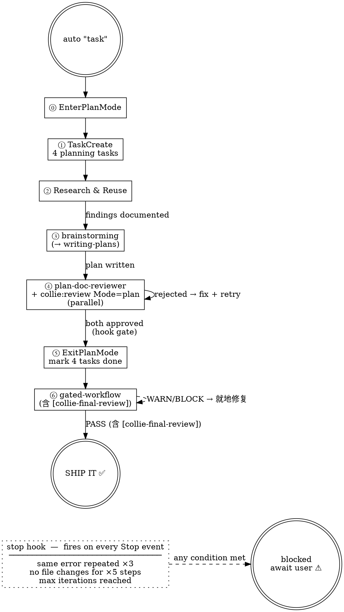

# Collie Auto

Run the complete development workflow Collie-style in fully automated, unattended mode.

## Completion Promise

This command uses ralph-loop. Completion signal: `<promise>Collie: SHIP IT</promise>`

**The completion signal can only be output when ALL of the following conditions are met:**
1. collie-harness:gated-workflow returns successfully (含 [collie-final-review] 返回 `**Status:** PASS`)
2. All code has been committed & pushed
3. worktree has been cleaned up

**Absolutely no false completion reporting allowed** (ralph-loop note: ONLY when statement is TRUE - do not lie to exit!)

## Anti-Patterns (skipping any = BLOCK red line)

**"R&R is unnecessary — brainstorming already explores the codebase"**
R&R covers external search (GitHub, registries, docs, specs). Brainstorming covers internal codebase exploration. They are complementary. Both are required.

**"I'll call writing-plans separately after brainstorming"**
`superpowers:brainstorming` invokes `writing-plans` at its final step. Calling writing-plans again will overwrite the plan. Do NOT call it separately.

**"The plan looks good enough — I'll skip one reviewer to save time"**
The hook will block ExitPlanMode anyway. Both `collie-harness:plan-doc-reviewer` AND `collie-harness:review` (Mode=plan) must return approval. There are no shortcuts.

**"只有大改动才需要 Impact Assessment"**
任何 plan 都必须有 Impact Assessment 章节。小改动可标注 `None — trivial change, no cross-module impact`。完全缺失此章节 = plan-doc-reviewer BLOCK。

**"gated-workflow 跑完直接 SHIP，rubric review 不必要"**
gated-workflow 内部已含 `[collie-final-review]` pre-merge gate。试图省略 = Step 5.7 GATE 违规 = red line。

## Mandatory Sequence (no skipping allowed; skipping = red line)

```
⓪ EnterPlanMode → 显式进入 plan mode（auto 全程依赖 planmode plan file 与 ExitPlanMode 门禁）
① Create planning TaskList via TaskCreate (4 items: [research], [plan-review], [collie-review], [exit])
② Research & Reuse → internal specs first, then external (GitHub, docs, registries)
③ superpowers:brainstorming → design alignment + writing-plans (triggered by brainstorming)
④ PARALLEL: Agent(collie-harness:plan-doc-reviewer) AND Skill(collie-harness:review Mode=plan)
   → both must approve before ⑤
⑤ ExitPlanMode → TaskUpdate all planning tasks completed, close planning TaskList
⑥ collie-harness:gated-workflow skill → complete implementation pipeline
   （内含 [collie-final-review] = Skill(collie-harness:review Mode=code)，作为 [finish] 前的 pre-merge gate）
⑦ gated-workflow 返回成功 → output completion signal
```



## Task Prompt

When starting, inject this as the working prompt (substitute $ARGUMENTS with the actual arguments):

> Your task: $ARGUMENTS
>
> Execute in the following order. Skipping any step = BLOCK red line.
>
> **Step ⓪ — EnterPlanMode（必须最先执行，无任何前置动作）**：
> 直接调用 `EnterPlanMode` 工具进入 plan mode。auto 全程依赖 planmode plan file（writing-plans 写入路径）与 ExitPlanMode hook 门禁，必须显式进入。已经在 plan mode 时跳过此步即可。
>
> <HARD-GATE>
> 在 EnterPlanMode 完成（或确认已在 plan mode）之前，禁止执行 TaskCreate / Research / brainstorming 等任何后续步骤。
> </HARD-GATE>
>
> **Step ① — Planning TaskList**：Use TaskCreate to create these 4 planning tasks (use TaskUpdate to mark each completed as you finish it):
> - [research] Research & Reuse (findings cited in plan)
> - [plan-review] Structural plan review (collie-harness:plan-doc-reviewer)
> - [collie-review] Collie rubric review (collie-harness:review Mode=plan)
> - [exit] ExitPlanMode + close planning tasks
>
> **Research & Reuse** — before designing anything, execute three inline steps:
>
> **R0 — Analyze & Classify（主 agent inline，不派 subagent）**
>   Read the task in full, then produce a research plan with three sections:
>   - **Internal specs + project-level skills to scan** (**必做，不可省略**): list concrete spec files / directories (e.g. `docs/*-spec.md`, `docs/superpowers/specs/`, `CLAUDE.md`, relevant `skills/*/SKILL.md`, `.claude/skills/*/SKILL.md`（项目级 skill——项目专属 SOP；**不扫** `~/.claude/skills/`，那是用户级）). Even trivial tasks must run this scan.
>   - R1 仍使用**同一个** Explore agent 完成 specs + skills 扫描，无需为 skills 拆单独 agent（grep/glob 成本不变）
>   - **External queries**: distinct web / GitHub search queries, each covering a different angle (patterns vs libraries vs prior art).
>   - **Libraries**: specific package names or frameworks worth checking against registries (npm / PyPI / crates.io) + Context7.
>
>   Then **classify complexity** — this drives dispatch in R1:
>   - **Simple** (well-known domain, small localized change, obvious solution) → 1× Explore `haiku` for internal scan + 1× web search is sufficient.
>   - **Complex** (novel pattern, cross-cutting change, unclear prior art, architectural impact) → Explore **at least `sonnet`** for internal scan + **≥2 web searches with genuinely different angles** (never the same query reworded).
>
> **R1 — Parallel Fan-out（一次性并发派发，单条消息多个 Agent 调用，禁止分轮）**
>   Dispatch the full research plan from R0 in a **single batched message**:
>   - `Agent(subagent_type="Explore", model=<haiku if Simple | sonnet+ if Complex>)` — scan & read every internal spec identified in R0 **in full**. This call is mandatory regardless of complexity.
>   - Web / GitHub search agents: **Simple → 1×** `Agent(general-purpose, model="sonnet")`; **Complex → ≥2×** `Agent(general-purpose, model="sonnet")`, each bound to a **distinct angle** from R0.
>   - If R0 identified libraries: add `Agent(general-purpose, model="haiku")` for registry + Context7 lookup (same batch).
>
>   Each subagent prompt must be self-contained (they cannot ask follow-up questions) and specify the expected return format.
>
> **R2 — Synthesis（主 agent inline）**
>   After all subagents return, inline-summarize findings into the plan: what exists internally (cite exact spec paths), what prior art / libraries were found or ruled out externally, and the chosen reuse strategy. Prefer adopting / porting / wrapping a proven solution over writing net-new code.
>   Mark [research] completed.
>
> <HARD-GATE>
> Do NOT call superpowers:brainstorming until Research & Reuse is complete with findings documented.
> </HARD-GATE>
>
> **Brainstorming** — call `superpowers:brainstorming` skill.
>   - brainstorming 会自己在 TaskList 中追加 9 条自己的 checklist 任务，作为本阶段的进度看板；我们的列表中不单独持有 [brainstorm] 条目
>   - Before calling: note these constraints for when brainstorming internally invokes writing-plans:
>     - **Plan location**: write to the path specified in the planmode system prompt. Do NOT write to `docs/superpowers/plans/` or `docs/superpowers/specs/`.
>     - **The plan file MUST start with these three metadata lines** (before the `# [Feature Name] Implementation Plan` heading):
>       ```
>       <!-- plan-source: /absolute/path/to/this/plan/file.md -->
>       <!-- plan-topic: my-feature-slug -->
>       <!-- plan-executor: collie-harness:gated-workflow -->
>       ```
>       `plan-topic` = kebab-case slug of the feature name (e.g. `binary-safe-prompts`).
>     - Record this path as `$PLAN_PATH`. These three lines are the only mechanism that survives the "clear context and execute" boundary — gated-workflow depends on them.
>     - **Plan header override**: Replace writing-plans' default "For agentic workers" line with:
>       ```
>       > **For agentic workers:** MUST invoke Skill('collie-harness:gated-workflow') to implement this plan.
>       ```
>     - **Task Execution DAG**: The plan's task list MUST be preceded by a DAG table:
>       ```markdown
>       ## Task Execution DAG
>       | Task | Batch | Depends on | Key files |
>       |------|-------|------------|-----------|
>       ```
>       `Key files` lists files each task creates or modifies. The gated-workflow plan-reader subagent depends on this table.
>     - Do NOT call writing-plans separately — brainstorming triggers it at its final step.
>     - **Approval delegation, NOT discussion suppression**: brainstorming's Step 5 ("User approves design?") and Step 8 ("User reviews written spec?") — 这两个**正式 approval 门** — are replaced by the collie dual-reviewer in Step ③. **However, user discussion is NOT skipped**: AskUserQuestion for clarification, option selection, and design refinement is expected throughout brainstorming. Auto mode delegates review authority to dual-reviewers; it does NOT suppress conversational engagement. 若用户在 brainstorming 中给出方向性反馈或拒绝某方案，主 agent 必须响应并迭代，而非机械推进。
>     - **Skip writing-plans Plan Review Loop**: writing-plans' built-in plan-document-reviewer per-chunk review is skipped in collie-harness. collie-harness Step ③ has stricter dual-reviewer review — do not run both.
>     - **Skip writing-plans Execution Handoff**: writing-plans' "Ready to execute?" prompt and skill recommendation are skipped in collie-harness. After the plan is written, return directly to auto.md Step ③ dual review.
>     - **Design doc + Plan = single file**: brainstorming's design doc and writing-plans' implementation plan both go into the planmode plan file. Do NOT write them separately to `docs/superpowers/specs/` or `docs/superpowers/plans/`. File structure: design spec first, then `---`, then implementation plan.
>     - **Impact Assessment（必做）**：brainstorming 的设计阶段必须包含影响面评估，结论写入 plan 的 "Impact Assessment" 章节：
>       1. **Directly affected**：本次直接修改的 module / file / public API / CLI / hook / skill / agent（精确到文件路径）
>       2. **Downstream consumers**：调用方 / 依赖 / 单元测试 / E2E 脚本 / 文档引用（枚举已知点，grep / rg 反查）
>       3. **Reverse impact**：非直接但受影响的点（缓存、持久状态、历史数据、跨 session 状态）
>       4. **触发条件**：满足任一即需完整 Impact Assessment — 改动跨 2+ 模块、修改已有 public API / CLI / hook / skill / agent、删除或重命名公开接口、修改共享 utilities
>       5. **豁免**：单文件 < 20 行改动 / 纯文档 / 纯注释 / trivial bug 修复 → 可标注 `None — trivial change, no cross-module impact`
>     - **E2E Assessment（必做）**：brainstorming 的设计阶段必须包含 E2E 可行性评估，结论写入 plan 的 "E2E Assessment" 章节：
>       1. **探测目标项目 e2e 基建**：
>          - 已知 pattern 扫描（启发列表）：`playwright.config.*`、`cypress.config.*`、`cypress/`、`e2e/`、`tests/e2e/`、`__tests__/e2e/`、`*.spec.ts`、`pytest.ini` + `markers: e2e`、`conftest.py` e2e fixture、`*_integration_test.go`、`testcontainers`、CI 配置中的 e2e 步骤、`docker-compose.test.yml`
>          - 开放探索：README/CONTRIBUTING 测试说明、`package.json`/`Makefile`/`Taskfile.yml` 中的 test 命令、其他可能的 e2e 基建
>       2. **项目类型 → e2e 策略映射**：Web app → 浏览器 e2e（Playwright）；API → HTTP 级 e2e；CLI → 命令执行级 e2e；Library → 集成调用级 e2e；纯算法 → 通常不需要 e2e
>       3. **Assessment 输出**：(a) 现有基建有/无及具体内容 (b) 若无 → 推荐建设方案，须问用户确认 (c) 本次需求的 e2e 策略：哪些 critical path 需覆盖 (d) 结论 `e2e_feasible: true/false`，false 须给出理由
>       4. **E2E ≠ 浏览器测试**：e2e 是测试范围（完整用户路径），headless 是浏览器运行模式，两者不冲突。不是所有 e2e 都需要浏览器。
>
> <HARD-GATE>
> Do NOT dispatch reviewers until brainstorming is fully complete and $PLAN_PATH is recorded.
> </HARD-GATE>
>
> **Dual review** — in parallel, dispatch BOTH reviewers:
>   a) `Agent(subagent_type="collie-harness:plan-doc-reviewer", model="opus")` — structural plan validation
>   b) `Skill("collie-harness:review")` with `Mode=plan`, `Target=$PLAN_PATH` — Collie-style rubric review
>   - Both must return approval before calling ExitPlanMode.
>   - If either reviewer returns WARN or BLOCK: fix the plan, then re-dispatch **both** reviewers from scratch. Do NOT only re-run the one that failed — fixing one issue can affect what the other reviewer sees.
>   - Repeat fix → re-dispatch both → check both until both return approval in the same round.
>   - Mark [plan-review] and [collie-review] completed only once both approve.
>
> <HARD-GATE>
> Do NOT call ExitPlanMode until BOTH reviewers return approval in the same review round.
> </HARD-GATE>
>
> **ExitPlanMode** — after returning from planmode, use TaskUpdate to mark all planning tasks ([research], [plan-review], [collie-review], [exit]) as completed. brainstorming 的 9 条子任务由 brainstorming skill 自身负责标记完成，无需我们管理。This closes the planning TaskList before gated-workflow appends the implementation tasks.
>
> **Implementation** — call `collie-harness:gated-workflow` skill.
>
> **Completion** — 当 `collie-harness:gated-workflow` 返回成功（内部 `[collie-final-review]` 返回 `**Status:** PASS`），output:
> `<promise>Collie: SHIP IT</promise>`
>
> 若 gated-workflow 内部出现无法自愈的 WARN / BLOCK（连续 3 轮修复失败），通过 `scripts/escalate.sh` 升级。

## Intelligent Exit Policy

The following conditions automatically trigger escalation (detected by stop-steps-counter hook):

- Same error appears consecutively 3 times → escalate WARN "loop_on_same_error"
- 5 consecutive steps with no file changes → escalate WARN "no_progress"
- Reaches `--max-iterations` (default 20) → escalate WARN "max_iterations"

These are automatically detected by the `stop-steps-counter.js` hook with no manual handling needed.

## Arguments

- `$ARGUMENTS`: task description (required)
- `--max-iterations N`: maximum number of iterations, default 20

## Usage Example

```
/collie-harness:auto "add hello.js that prints 'collie mode'"
/collie-harness:auto "refactor auth module to use JWT" --max-iterations 30
```
