# `/collie-harness:auto` State Machine — Detailed

```dot
digraph collie_auto {
    // ── Terminals ────────────────────────────────────────────────
    "invoke /collie-harness:auto" [shape=doublecircle];
    "SHIP IT ✅"                  [shape=doublecircle];
    "blocked\nawait user ⚠️" [shape=doublecircle];

    // ── Decision gates ───────────────────────────────────────────
    "plan-doc-reviewer\napproved?"         [shape=diamond];
    "collie:review\nMode=plan PASS?"       [shape=diamond];
    "ExitPlanMode\nhook gate"              [shape=diamond];
    "stop hook\n(every Stop event)\n─────────────────\nsame error ×3\nno file changes ×5\nmax iterations" [shape=box, style=dotted];

    // ── Process nodes ────────────────────────────────────────────
    "⓪ TaskCreate\n[research][plan-review]\n[collie-review][exit]" [shape=box];
    "① Research & Reuse"                                           [shape=box];
    "② superpowers:brainstorming\n↳ triggers writing-plans"        [shape=box];
    "(brainstorming internals:\n9 sub-tasks, self-managed)"          [shape=box, style=dashed];
    "③ PARALLEL:\nAgent(plan-doc-reviewer)\nSkill(collie:review Mode=plan)" [shape=box];
    "④ ExitPlanMode\nTaskUpdate → mark all 4 done"                 [shape=box];
    // gated-workflow 节点已展开为 cluster，见下方 subgraph
    "fix issues"                                                    [shape=box];

    // ── Main flow ────────────────────────────────────────────────
    "invoke /collie-harness:auto"
        -> "⓪ TaskCreate\n[research][plan-review]\n[collie-review][exit]";

    "⓪ TaskCreate\n[research][plan-review]\n[collie-review][exit]"
        -> "① Research & Reuse";

    "① Research & Reuse"
        -> "② superpowers:brainstorming\n↳ triggers writing-plans"
           [label="findings documented\n(found or ruled out)\n→ mark [research] done"];

    "② superpowers:brainstorming\n↳ triggers writing-plans"
        -> "(brainstorming internals:\n9 sub-tasks, self-managed)"
           [style=dashed, label="creates"];
    "② superpowers:brainstorming\n↳ triggers writing-plans"
        -> "③ PARALLEL:\nAgent(plan-doc-reviewer)\nSkill(collie:review Mode=plan)"
           [label="plan written\n→ $PLAN_PATH recorded"];

    // ── Dual-review fan-out ───────────────────────────────────────
    "③ PARALLEL:\nAgent(plan-doc-reviewer)\nSkill(collie:review Mode=plan)"
        -> "plan-doc-reviewer\napproved?";
    "③ PARALLEL:\nAgent(plan-doc-reviewer)\nSkill(collie:review Mode=plan)"
        -> "collie:review\nMode=plan PASS?";

    "plan-doc-reviewer\napproved?"
        -> "ExitPlanMode\nhook gate"
           [label="yes → mark [plan-review] done"];
    "plan-doc-reviewer\napproved?"
        -> "③ PARALLEL:\nAgent(plan-doc-reviewer)\nSkill(collie:review Mode=plan)"
           [label="no → fix + re-dispatch"];

    "collie:review\nMode=plan PASS?"
        -> "ExitPlanMode\nhook gate"
           [label="yes → mark [collie-review] done"];
    "collie:review\nMode=plan PASS?"
        -> "③ PARALLEL:\nAgent(plan-doc-reviewer)\nSkill(collie:review Mode=plan)"
           [label="no → fix + re-dispatch"];

    // ── Hook gate ────────────────────────────────────────────────
    "ExitPlanMode\nhook gate"
        -> "④ ExitPlanMode\nTaskUpdate → mark all 4 done"
           [label="both approved\n(post-writing-plans-reviewer allows)"];
    "ExitPlanMode\nhook gate"
        -> "③ PARALLEL:\nAgent(plan-doc-reviewer)\nSkill(collie:review Mode=plan)"
           [label="not both → decision:block"];

    // ── Post-planmode ─────────────────────────────────────────────
    "④ ExitPlanMode\nTaskUpdate → mark all 4 done"
        -> GW_START;

    // ── ⑤ gated-workflow (substate machine) ──────────────────────
    subgraph cluster_gw {
        label="⑤ gated-workflow";
        style=dashed;

        GW_START [shape=box, label="Step 0: create worktree\n(using-git-worktrees)"];
        GW1      [shape=box, label="Step 1: plan-reader subagent\n(haiku: 提取 DAG + 行号 + 冲突)\n→ TaskCreate TodoList\n+ plan-todo 交叉核对\n(haiku subagent)"];
        GW2      [shape=box, label="Step 2: archive plan\n(cp → docs/plans/)"];
        GW3      [shape=box, label="Step 3: dispatch batch\n(dispatching-parallel-agents)"];
        GW4      [shape=box, label="per task:\nTDD → VBC → CR subagent\n↳ fix issues: dispatch fix subagent\n→ re-CR，循环至通过"];
        GW_MORE  [shape=diamond, label="more batches?"];
        GW5      [shape=box, label="Step 5: run tests\n(unit 0 failures\n+ e2e if feasible)"];
        GW55     [shape=box, label="Step 5.5: doc-refresh\n(README / CLAUDE.md / spec)"];
        GW57     [shape=box, label="Step 5.7: [collie-final-review]\n(collie:review Mode=code\nTarget: worktree diff)"];
        GW57_gate [shape=diamond, label="collie:review\nMode=code result?"];
        GW7      [shape=box, label="Step 6: finishing-branch\n(merge / PR / cleanup)"];

        GW_START -> GW1 -> GW2 -> GW3 -> GW4 -> GW_MORE;
        GW_MORE  -> GW3  [label="yes → next batch"];
        GW_MORE  -> GW5  [label="no → all done"];
        GW5 -> GW55 -> GW57 -> GW57_gate;
        GW57_gate -> GW7      [label="PASS"];
        GW57_gate -> "fix issues" [label="WARN/BLOCK"];
    }

    GW7 -> "SHIP IT ✅";
    "fix issues" -> GW_START;

    // ── Stop hook side channel ────────────────────────────────────
    "stop hook\n(every Stop event)\n─────────────────\nsame error ×3\nno file changes ×5\nmax iterations"
        -> "blocked\nawait user ⚠️"
           [label="any condition met", style=dashed];

    // ── Anchor side channel to bottom ────────────────────────────
    { rank=sink;
      "stop hook\n(every Stop event)\n─────────────────\nsame error ×3\nno file changes ×5\nmax iterations";
      "blocked\nawait user ⚠️"; }
}
```

---

## 图例

| 形状 | 含义 |
|------|------|
| 双圆 | 起始 / 终止状态 |
| 菱形 | 决策 / 门禁节点 |
| 实线框 | 执行步骤 |
| 虚线框 | 外部组件内部状态（不由本层管理） |
| 虚线边 | 跨边界创建关系 |

## 开放问题

- **Q1** Hook gate 与 HARD-GATE 是否拆成两个菱形？
- **Q2** ~~reviewer 失败时 re-dispatch 几个？~~ 已确认：fix + re-dispatch，循环无限制，stop hook 不作为该阶段的退出机制，可接受。
- **Q3** ExitPlanMode 段是否需要补一句「brainstorming 的 9 条不要 TaskUpdate」？
- **Q4** gated-workflow 内部是否展开为子状态机？
