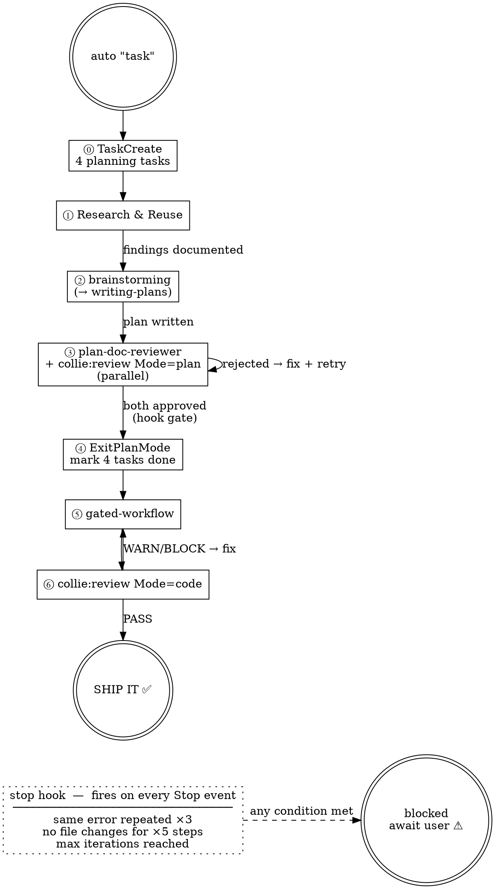

# `/collie:auto` State Machine — Simplified

```dot
digraph collie_auto {
    // ── Terminals ────────────────────────────────────────────────
    START [shape=doublecircle, label="auto \"task\""];
    SHIP  [shape=doublecircle, label="SHIP IT ✅"];
    ESC   [shape=doublecircle, label="blocked\nawait user ⚠️"];

    // ── Steps ────────────────────────────────────────────────────
    TASK   [shape=box, label="⓪ TaskCreate\n4 planning tasks"];
    RR     [shape=box, label="① Research & Reuse"];
    BRAIN  [shape=box, label="② brainstorming\n(→ writing-plans)"];
    REVIEW [shape=box, label="③ plan-doc-reviewer\n+ collie:review Mode=plan\n(parallel)"];
    EXIT   [shape=box, label="④ ExitPlanMode\nmark 4 tasks done"];
    IMPL   [shape=box, label="⑤ gated-workflow"];
    CR     [shape=box, label="⑥ collie:review Mode=code"];

    // ── Session-wide stop hook (side channel) ────────────────────
    MONITOR [shape=box, style=dotted,
             label="stop hook  —  fires on every Stop event\n─────────────────────────────────\nsame error repeated ×3\nno file changes for ×5 steps\nmax iterations reached"];

    // ── Edges ────────────────────────────────────────────────────
    START  -> TASK;
    TASK   -> RR;
    RR     -> BRAIN  [label="findings documented"];
    BRAIN  -> REVIEW [label="plan written"];
    REVIEW -> EXIT   [label="both approved\n(hook gate)"];
    REVIEW -> REVIEW [label="rejected → fix + retry"];
    EXIT   -> IMPL;
    IMPL   -> CR;
    CR     -> SHIP   [label="PASS"];
    CR     -> IMPL   [label="WARN/BLOCK → fix"];

    MONITOR -> ESC [label="any condition met", style=dashed];

    { rank=sink; MONITOR; ESC; }
}
```
