# `/collie-harness:auto` State Machine

## Flow Diagram

```dot
digraph collie_auto_flow {
    // ── Terminal states ──────────────────────────────────────────
    "invoke /collie-harness:auto" [shape=doublecircle];
    "SHIP IT ✅"                  [shape=doublecircle];
    "ESCALATE ⚠️"                 [shape=doublecircle];

    // ── Decision gates ───────────────────────────────────────────
    "R&R findings\ndocumented?"            [shape=diamond];
    "brainstorming +\nwriting-plans done?" [shape=diamond];
    "plan-doc-reviewer\napproved?"         [shape=diamond];
    "collie:review\nMode=plan PASS?"       [shape=diamond];
    "ExitPlanMode\nhook gate\n(post-writing-plans-reviewer)" [shape=diamond];
    "collie:review\nMode=code result?"     [shape=diamond];
    "stop hook:\nloop / stall?"            [shape=diamond];

    // ── Process nodes ────────────────────────────────────────────
    "⓪ TaskCreate\n[research][plan-review]\n[collie-review][exit]" [shape=box];
    "① Research & Reuse"                                           [shape=box];
    "② superpowers:brainstorming\n↳ triggers writing-plans"        [shape=box];
    "(brainstorming 内部：\n9 sub-tasks，自管理)"                    [shape=box, style=dashed];
    "③ PARALLEL:\nAgent(plan-doc-reviewer)\nSkill(collie:review Mode=plan)" [shape=box];
    "④ ExitPlanMode\nTaskUpdate → mark all 4 done"                 [shape=box];
    "⑤ collie-harness:gated-workflow\n(worktree→impl→tests→merge)" [shape=box];
    "⑥ collie:review Mode=code\nTarget: worktree diff"             [shape=box];
    "fix issues"                                                    [shape=box];

    // ── Main flow ────────────────────────────────────────────────
    "invoke /collie-harness:auto"
        -> "⓪ TaskCreate\n[research][plan-review]\n[collie-review][exit]";

    "⓪ TaskCreate\n[research][plan-review]\n[collie-review][exit]"
        -> "① Research & Reuse";

    "① Research & Reuse"
        -> "R&R findings\ndocumented?";

    "R&R findings\ndocumented?"
        -> "② superpowers:brainstorming\n↳ triggers writing-plans"
           [label="yes → mark [research] done"];
    "R&R findings\ndocumented?"
        -> "① Research & Reuse"
           [label="no (continue)"];

    "② superpowers:brainstorming\n↳ triggers writing-plans"
        -> "(brainstorming 内部：\n9 sub-tasks，自管理)"
           [style=dashed, label="creates"];
    "② superpowers:brainstorming\n↳ triggers writing-plans"
        -> "brainstorming +\nwriting-plans done?";

    "brainstorming +\nwriting-plans done?"
        -> "③ PARALLEL:\nAgent(plan-doc-reviewer)\nSkill(collie:review Mode=plan)"
           [label="yes → $PLAN_PATH recorded"];
    "brainstorming +\nwriting-plans done?"
        -> "② superpowers:brainstorming\n↳ triggers writing-plans"
           [label="no (wait)"];

    // ── Dual-review fan-out ───────────────────────────────────────
    "③ PARALLEL:\nAgent(plan-doc-reviewer)\nSkill(collie:review Mode=plan)"
        -> "plan-doc-reviewer\napproved?";
    "③ PARALLEL:\nAgent(plan-doc-reviewer)\nSkill(collie:review Mode=plan)"
        -> "collie:review\nMode=plan PASS?";

    "plan-doc-reviewer\napproved?"
        -> "ExitPlanMode\nhook gate\n(post-writing-plans-reviewer)"
           [label="yes → mark [plan-review] done"];
    "plan-doc-reviewer\napproved?"
        -> "③ PARALLEL:\nAgent(plan-doc-reviewer)\nSkill(collie:review Mode=plan)"
           [label="no → fix + re-dispatch"];

    "collie:review\nMode=plan PASS?"
        -> "ExitPlanMode\nhook gate\n(post-writing-plans-reviewer)"
           [label="yes → mark [collie-review] done"];
    "collie:review\nMode=plan PASS?"
        -> "③ PARALLEL:\nAgent(plan-doc-reviewer)\nSkill(collie:review Mode=plan)"
           [label="no → fix + re-dispatch"];

    // ── Hook gate ────────────────────────────────────────────────
    "ExitPlanMode\nhook gate\n(post-writing-plans-reviewer)"
        -> "④ ExitPlanMode\nTaskUpdate → mark all 4 done"
           [label="both approved\n(allows)"];
    "ExitPlanMode\nhook gate\n(post-writing-plans-reviewer)"
        -> "③ PARALLEL:\nAgent(plan-doc-reviewer)\nSkill(collie:review Mode=plan)"
           [label="not both\n→ decision:block"];

    // ── Post-planmode ─────────────────────────────────────────────
    "④ ExitPlanMode\nTaskUpdate → mark all 4 done"
        -> "⑤ collie-harness:gated-workflow\n(worktree→impl→tests→merge)";

    "⑤ collie-harness:gated-workflow\n(worktree→impl→tests→merge)"
        -> "⑥ collie:review Mode=code\nTarget: worktree diff";

    "⑥ collie:review Mode=code\nTarget: worktree diff"
        -> "collie:review\nMode=code result?";

    "collie:review\nMode=code result?" -> "SHIP IT ✅"   [label="PASS"];
    "collie:review\nMode=code result?" -> "fix issues"   [label="WARN/BLOCK"];
    "fix issues"
        -> "⑤ collie-harness:gated-workflow\n(worktree→impl→tests→merge)";

    // ── Stop hook (side channel，每轮 Stop 事件触发) ────────────────
    "stop hook:\nloop / stall?"
        -> "ESCALATE ⚠️"
           [label="same_error ×3\nno_progress ×5\nmax_iterations"];
}
```



---

## 待 Review 的开放问题

### Q1：Hook gate 与 HARD-GATE 的关系是否应在图里显式画出？

prompt 里有三个 `<HARD-GATE>`，hook 里还有 `decision:block`，二者构成两层防御：

| 层 | 机制 | 失效条件 |
|----|------|---------|
| prompt 层 | `<HARD-GATE>` 指令 | 模型忽视 prompt 约束 |
| runtime 层 | hook `decision:block` | hook 脚本自身 bug |

当前图把两层都汇聚到同一个 `ExitPlanMode hook gate` 菱形里，没有显式画出「prompt 层 GATE 失效时 hook 层接管」的 fallback 边。现状是否够清晰，还是需要拆成两个菱形？

---

### Q2：plan-doc-reviewer PASS 但 collie:review FAIL 时，是否需要 re-dispatch 两个还是只 re-dispatch 失败的那个？

当前图（和 prompt）都画的是「fix + re-dispatch **两个**」。

- **理由 A（re-dispatch 两个）**：plan 被修改后，plan-doc-reviewer 的结论可能失效，需要重新确认。更安全。
- **理由 B（只 re-dispatch 失败的）**：hook state 对两个 reviewer 独立记录，re-dispatch 未失败的那个是冗余消耗。

当前 prompt 没有明确规定，行为由模型自由裁量——是否需要在 `commands/auto.md` 里加一句明确说明？

---

### Q3：brainstorming 内部 9 条 sub-task 与我们的 4 条规划任务在同一 TaskList 共存的可见状态

brainstorming 完成后，TaskList 快照：

```
[research]               → completed  ← 我们标
[plan-review]            → pending    ← 我们标
[collie-review]          → pending    ← 我们标
[exit]                   → pending    ← 我们标
Explore project context  → completed  ← brainstorming 标
Ask clarifying questions → completed  ← brainstorming 标
Generate design options  → completed  ← brainstorming 标
... (共 9 条)            → completed  ← brainstorming 标
```

图里用虚线框区分了"brainstorming 内部 9 sub-tasks"，但 TaskList 里它们和我们的 4 条**平级并列**，没有视觉层级区分。这是否会让执行中的模型感到困惑（不知道哪些该它 TaskUpdate，哪些归 brainstorming 管）？

当前 `commands/auto.md` 在 Brainstorming 叙述里已加了一句说明：
> brainstorming 会自己在 TaskList 中追加 9 条自己的 checklist 任务，作为本阶段的进度看板；我们的列表中不单独持有 [brainstorm] 条目

是否需要在 ExitPlanMode 步骤里也加一句「brainstorming 的 9 条不要 TaskUpdate，它们由 brainstorming 自己标记」，防止模型在清理时误操作？

---

### Q4：gated-workflow 是否需要展开为子状态机？

当前 ⑤ 是黑盒。gated-workflow 内部实际是：

```
Step 0: worktree 隔离
Step 1: TaskCreate 实施阶段 TodoList
Step 2: 归档计划文档
Step 3: 并行 dispatch 实现 subagent（按 batch）
Step 4: 每条 task：TDD + VBC + CR
Step 5: 代码质量洞察（simplify，累计 >100 行触发）
Step 6: 测试全通（0 failures）
Step 7: finishing-a-development-branch
```

如果 auto 和 gated-workflow 要合并成一张完整的系统状态机，需要展开。但那张图会很大。
**建议**：保持两张独立图（auto 层 + gated-workflow 层），用「调用子状态机」标注边即可。

---

## 图例

| 形状 | 含义 |
|------|------|
| 双圆 | 起始 / 终止状态 |
| 菱形 | 决策 / 门禁节点 |
| 实线框 | 执行步骤 |
| 虚线框 | 外部组件内部状态（不由本层管理） |
| 虚线边 | 跨边界调用 / 创建关系 |
| 实线边（侧道） | 异步触发的 hook 流 |
