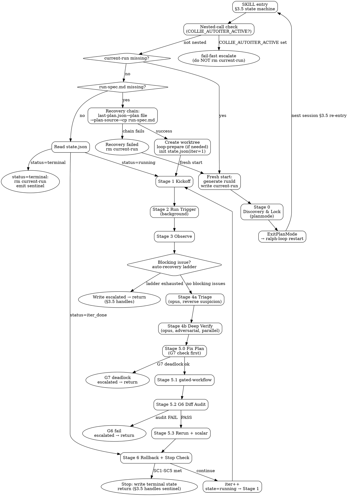

# collie-harness:autoiter — Main Autoiter Orchestrator

Drives the iterative improvement pipeline: run trigger → observe → triage → deep-verify → gated fix → rerun → stop check. Invoked by `commands/autoiter.md` on every ralph-loop session restart.

**Completion signal**: `<promise>Collie: AUTOITER DONE</promise>`
**Sentinel rule**: Emitted ONLY by the §3.5 terminal branch. NO other stage emits it inline.

---

## Flowchart



---

## Section 0 — Orchestrator Contract（必读，约束所有 stage）

⛔ **主 session 是协调器，不是执行器。**

### 主 session 禁止做的事

- ❌ 读项目源代码（src 文件）
- ❌ grep / find / 全文搜索项目代码（除单点 hash/scalar 提取）
- ❌ 写实现代码 / 修复代码
- ❌ 解析 > 50 行日志
- ❌ inline 执行 git revert / git reset --hard 实质操作

### 主 session 必须做的事

- ✅ 决策（基于 subagent 输出）
- ✅ dispatch 子 agent + 状态文件读写
- ✅ 写 status.md / progress.md / fix-plan.md（汇总 subagent 输出）
- ✅ 触发外部命令（trigger / rerun bash 启动）但不解析 stdout

### 主 session 例外项（明文允许 inline）

仅以下 5 类操作允许 inline，逻辑上是单点动作：

1. Stage 2 `nohup bash` 启动 trigger（单行命令）
2. Stage 5.0 写 `fix-plan.md`（仅汇总 4b deep-verify 输出，禁止读源码）
3. Stage 5.2 `git diff HEAD~1..HEAD --name-only`（单行 git，结果不解析）
4. 状态文件 IO（`~/.collie-harness/autoiter/...` 下的 status / progress / state）
5. iter 边界的目录创建（`mkdir -p iter-N/`）

### Subagent 派发裁定基准（主 agent 自主裁定，不在 plan 硬编码）

每次需要执行操作时，主 agent 按以下基准**自主裁定** inline vs dispatch + model：

**裁定步骤**：
1. 此步是"决策"还是"执行"？决策 inline，执行 dispatch
2. 输入是否会污染主 agent 上下文（log / source code / 大返回）？是 → dispatch
3. 选 model：参考用户 `~/.claude/CLAUDE.md` 中的"Agent 模型选择速查"+"Subagent 派发策略"两节

**Agent 模型选择速查**（节选自用户 CLAUDE.md）：
- `Explore` → haiku（文件搜索、代码分析、只读探索）
- `general-purpose 轻量` → haiku（文档生成、简单分析）
- `general-purpose 标准` → sonnet（代码实现、中等复杂度）
- `general-purpose 复杂` → opus（架构决策、复杂重构）
- `code-reviewer` → sonnet
- `Plan` → opus（架构设计、规划）

**典型应用例子**（参考，非强制；具体 stage 由主 agent 实时裁定）：
- 应用 fix patch 到 worktree → 实现型 → dispatch sonnet
- 解析 raw.log 提 scalar → 文档/分析型 → dispatch haiku
- 写 fix-plan.md 综合 → 决策型 → inline（受 §例外项 #2 约束）
- 跑 git revert + verify hash → 执行型 → dispatch haiku
- Triage / Deep Verify → 复杂推理型 → dispatch opus（这是历史不变式，contract test 强制）

### 历史不变式（contract test 强制保留）

- Stage 4a/4b（Triage / Deep Verify）必须保持 opus subagent，不可降为 inline 或更低 model
- Stage 5.0 fix-plan 必须保持 inline 但受 §例外项 #2 约束

任何其他 stage 的 inline / dispatch + model 选择由主 agent 实时裁定，plan 不硬编码。

---

## §3.5 Entry State Machine (FIRST thing executed every session)

### Setup

```bash
PROJECT_ID=$(node -e "const s=require('./hooks/_state.js'); console.log(s.projectId())")
CURRENT_RUN_FILE=$(node -e "const s=require('./hooks/_state.js'); console.log(s.currentRunFile('$PROJECT_ID'))")
```

### Nested-call check

If `COLLIE_AUTOITER_ACTIVE` environment variable is set → this is a nested call from inside another `/auto` or `/loop` session.

Action: call `scripts/escalate.sh "nested_loop_call" "$PROJECT_ID"` then **stop immediately**. Do NOT rm current-run (the outer run owns it).

If not nested: set `export COLLIE_AUTOITER_ACTIVE=1` for all subprocesses in this session, then proceed.

### Branch A — No current-run file

`~/.collie-harness/autoiter/{project-id}/current-run` does NOT exist → **Fresh start**:

1. Generate `runId`: `YYYYMMDD-HHMMSS-{shortSessionId}` (use `date +%Y%m%d-%H%M%S` + first 6 chars of `$CLAUDE_SESSION_ID` or random hex)
2. `mkdir -p ~/.collie-harness/autoiter/{project-id}/`
3. Write runId to current-run file
4. Proceed to Stage 0

### Branch B — current-run exists, run-spec.md does NOT exist

Post-planmode recovery path:

1. `runId = $(cat $CURRENT_RUN_FILE)`
2. Attempt recovery chain:
   - Read `~/.collie-harness/state/{sessionId}/last-plan.json` → get plan file path
   - Read first 3 lines of plan file → extract `plan-source` field value
   - If recovery chain fails at any step → `rm $CURRENT_RUN_FILE` → go to Branch A
3. Recovery succeeded:
   ```bash
   mkdir -p ~/.collie-harness/autoiter/{project-id}/{runId}/
   # ⛔ NEVER use Write or Edit — cp only (prevents LLM rewriting content)
   cp "$PLAN_SOURCE" ~/.collie-harness/autoiter/{project-id}/{runId}/run-spec.md
   git worktree add .worktrees/autoiter-{runId} -b autoiter/{runId}
   echo "$(pwd)/.worktrees/autoiter-{runId}" > ~/.collie-harness/autoiter/{project-id}/{runId}/worktree-path
   ```
4. Read `skip_prepare` from run-spec.md
5. If `skip_prepare=false` AND `prepare-report.md` does NOT exist:
   - Call `Skill('collie-harness:autoiter-prepare')` with: `run_spec_path`, `report_path`, `project_id`, `run_id`, `worktree_path`
   - PASS → continue
   - FAIL (interactive): `AskUserQuestion "Prepare failed: [X]. Fix material and retry, or abort?"`
   - FAIL (queued): write `state.json.status="escalated"` → **return** (§3.5 terminal handles on next restart)
6. Initialize `state.json`:
   ```json
   {
     "runId": "<runId>",
     "iter": 1,
     "status": "running",
     "should_continue": true,
     "stop_reason": null,
     "last_scalar": null,
     "baseline_scalar": null,
     "promise_signal": "Collie: AUTOITER DONE"
   }
   ```
7. Proceed to Stage 1

### Branch C — current-run AND run-spec.md exist

Read `state.json`:

| status | action |
|--------|--------|
| `"running"` | Re-enter Stage 1 kickoff (idempotent: skip write if kickoff.md already exists) |
| `"iter_done"` | Proceed to Stage 6 stop check |
| `"converged"` / `"budget_exhausted"` / `"escalated"` | **Terminal**: rm current-run → print `[loop {runId}] All done — status={status}` → emit `<promise>Collie: AUTOITER DONE</promise>` → stop |
| missing | Treat same as Branch B (run-spec.md missing path) |

---

## Stage 0 — Discovery & Lock (planmode)

**Only reached on fresh start from Branch A.**

### Step 0.1 — Enter planmode

Call `EnterPlanMode`.

### Step 0.2 — Discovery subagent (haiku, Explore / read-only)

Dispatch haiku subagent using system prompt from `skills/autoiter/references/discovery-prompt.md`. Input: project root. Output:
- Ranked candidate trigger list (each: command, kind, score 1-5, rationale)
- Suggested `success_criterion` type (`all_green` / `scalar_threshold` / `convergence_delta` / `custom`)
- Suggested `primary_goal` (`correctness` / `optimization` / `both`)

### Step 0.3 — AskUserQuestion (Q1-Q5)

Collect all 5 in one batch:
- **Q1**: Which trigger? (show ranked list from Discovery; allow custom)
- **Q2**: Success criterion type and threshold?
- **Q3**: `primary_goal`? (`correctness` / `optimization` / `both`)
- **Q4**: `iter_rollback_policy`? (default: `kind_aware`)
- **Q5**: Skip Stage 0.5 prepare check? (default: No)

### Step 0.4 — Write run-spec to planmode plan file

Write to planmode system-prompt-specified plan file (do NOT override path). Top 3 lines must be:

```
<!-- plan-source: <planmode plan file absolute path> -->
<!-- plan-kind: autoiter-stage0 -->
<!-- plan-executor: collie-harness:autoiter -->
```

Body YAML:
```yaml
task: <user prompt verbatim>
primary_goal: <Q3>
trigger:
  kind: shell|replay|dataset
  invocation: "<shell command>"
  expected_output: "stdout stream / junit xml / custom parser"
  scalar_extraction: "<grep/regex/jq path>"
success_criterion:
  type: all_green|scalar_threshold|convergence_delta|custom
  threshold: <Q2 value>
budget:
  max_iterations: 5
  max_tokens: unlimited
  max_wallclock_min: unlimited
overfit_guards: [G1, G2, G3, G4, G5, G6, G7, G8]
iter_rollback_policy: kind_aware
skip_prepare: false
```

### Step 0.5 — ExitPlanMode

Call `ExitPlanMode`. This is the **ONLY** exit from Stage 0.

ralph-loop restarts the session. §3.5 Branch B (recovery path) handles everything after.

---

## Stage 1 — Kickoff (idempotent)

### Step 0 — TaskCreate stage 锚定（每 iter 起始必做）

⛔ 每次进入 Stage 1（iteration 起始）必须先做这一步，再做原 Step 1。

1. 上一 iter 的 `[iter-{N-1} stage-*]` 任务先标 completed（正常结束）或 deleted（被 rollback）
2. `TaskCreate` 6 次建立本 iter 锚点：
   - `[iter-N stage-1] Kickoff（git HEAD + baseline）`
   - `[iter-N stage-2] Run trigger（subprocess background + Monitor/tail）`
   - `[iter-N stage-3] Observe（ISSUE 收集 + auto-recovery 阶梯）`
   - `[iter-N stage-4] Triage + Deep Verify（4a/4b opus）`
   - `[iter-N stage-5] Fix Plan + gated-workflow + G6 audit + Rerun（5.0/5.1/5.2/5.3）`
   - `[iter-N stage-6] Rollback + Stop Check`

   `N` 从 state.json 读取
3. `TaskUpdate [iter-N stage-1] in_progress`，进入原 Step 1
4. **Self-anchor**：长 dispatch（subagent 返回 > 200 字符或耗时 > 30s）后，主 agent 必须先 `TaskList` 确认当前 anchor 与 SKILL 当前 stage 一致；漂移 → STOP + escalate `stage_anchor_drift`。Stage 切换时 `TaskUpdate` 切 completed/in_progress 后再进入下一 stage。

**All Stage 1+ work runs inside the worktree.** Read `worktree-path` to get the absolute path.

```bash
WORKTREE=$(cat ~/.collie-harness/autoiter/{project-id}/{runId}/worktree-path)
ITER_DIR=~/.collie-harness/autoiter/{project-id}/{runId}/iter-{N}
mkdir -p $ITER_DIR/fixes
```

Write `iter-N/kickoff.md` (skip if already exists — idempotency):
```markdown
# Kickoff — iter-N
git_head: <git rev-parse HEAD>
baseline_metric: <state.last_scalar or "none (first iter)">
iter_goal: <based on progress.md DEFERRED pool if iter > 1>
timestamp: <ISO-8601>
```

**Observability**:
- Overwrite `status.md`: `iter N/M · Stage 1 · Kickoff · preparing trigger`
- Append `user-log.md`: `## iter-N · <ts>\nKickoff. HEAD: <sha>. Baseline scalar: <val>.`
- Stdout: `[loop {runId}] iter-N Stage 1 → Kickoff`

---

## Stage 2 — Run Trigger

### Subprocess timeout
```
timeout_min = min(max_wallclock_min / max_iterations, 30)
# "unlimited" in either field → use 30 min
```

### Launch (background)
```bash
# Bash run_in_background=true
cd $WORKTREE
timeout ${timeout_min}m bash -c "<trigger.invocation>" \
  > $ITER_DIR/raw.log 2>&1
echo "EXIT_CODE:$?" >> $ITER_DIR/raw.log
```

### Monitor detection (once per session, cache result)

```
ToolSearch query="select:Monitor"
```

**Monitor available**: Subscribe to stdout stream in real-time. Record observations to `iter-N/raw.log`.

**Monitor NOT available** (fallback):
- `ScheduleWakeup delaySeconds=60` on each poll cycle
- On wakeup: Read last 100 lines of `raw.log`
- Scan for ISSUE patterns (errors, metrics)
- Loop until `EXIT_CODE:` line appears in `raw.log`

**Observability**:
- Overwrite `status.md`: `iter N/M · Stage 2 · Running trigger · <elapsed>s elapsed`
- Stdout: `[loop {runId}] iter-N Stage 2 → trigger running (timeout: {timeout_min}min)`

---

## Stage 3 — Observe & Auto-Recovery

⚠️ 本 stage 内每次执行操作前请按 §Section 0 裁定基准选择 inline / dispatch + model。fix 应用属"执行"型，参考速查表选 sonnet。

### Step 3.1 — Write observations.md

Parse `raw.log`. For each issue:
```markdown
## ISSUE-{nnn}
- title: <one-line summary>
- evidence: <log excerpt, max 5 lines>
- severity: 1-5
- first_seen_ts: <monotonic>
- blocking: true|false
```

Non-blocking issues → record and continue to Stage 4a.

### Step 3.2 — Blocking issue: auto-recovery ladder

Triggered when `blocking: true` or exit code non-zero.

**Step 1**: Kill subprocess:
```bash
kill -TERM <pid>; sleep 5; kill -KILL <pid> 2>/dev/null || true
```

**Step 2**: Assess complexity → choose start model:
- Simple (syntax/params/config) → haiku
- Medium (logic/deps/env) → sonnet
- Complex (concurrency/perf/arch) → opus

**Step 3**: Recovery loop, max 3 attempts:
1. Dispatch diagnostic subagent at current model (input: last 200 lines of `raw.log` + `run-spec.md`; output: `root_cause` + `fix_patch`)
2. Apply fix in worktree
3. Rerun trigger with 5-min cap for quick validation
4. If passes → break (recovery succeeded), proceed to Stage 4a
5. If fails → upgrade model: haiku→sonnet→sonnet→opus→opus (cap at opus)

**Step 4**: All 3 attempts fail → unrecoverable:
1. Write `iter-N/blocker-report.md` (each attempt: model, root_cause, fix_applied, result)
2. Overwrite `status.md`: `iter N/M · Stage 3 · BLOCKED · auto-recovery ladder exhausted`
3. Append to `user-log.md`
4. `scripts/escalate.sh "blocker_unrecoverable" "$RUN_ID"`
5. If `$COLLIE_AUTOITER_NOTIFY_CMD` set: `bash -c "$COLLIE_AUTOITER_NOTIFY_CMD"` with env `COLLIE_AUTOITER_EVENT=blocker_unrecoverable`, `COLLIE_AUTOITER_RUN_ID`, `COLLIE_AUTOITER_STATUS_FILE`
6. Write `state.json.status = "escalated"`
7. **RETURN** — §3.5 terminal handles sentinel on next restart. Do NOT emit inline.

**Observability**:
- Overwrite `status.md`: `iter N/M · Stage 3 · Observing · {n} issues found`
- Stdout: `[loop {runId}] iter-N Stage 3 → {n} issues recorded, {m} blocking`

---

## Stage 4a — Triage (opus, "reverse suspicion")

Dispatch single opus subagent.

**System prompt requirements (G3)**:
- Must include the phrase **"reverse suspicion"**
- Must instruct: "Start by finding reasons why each issue is NOT real before concluding it is"
- Max 2 lines verbatim from `observations.md` (anchor prevention)

**Inputs**: `iter-N/observations.md` + `run-spec.md` + `progress.md`

**Output**: `iter-N/triage.md`
```markdown
## ISSUE-{nnn}
verdict: Real | Discarded | Unclear
confidence: 1-5
rationale: <adversarial reasoning>
```

### G8 Gate (Triage level)

| condition | action |
|-----------|--------|
| confidence ≥ 3, verdict Real/Unclear | Proceed to Stage 4b |
| confidence ≤ 2, verdict Real/Unclear | Write to `progress.md` DEFERRED pool, tag `triage_low_confidence`; skip Stage 4b |
| Discarded (any confidence) | Drop silently; do NOT write to DEFERRED |

**Observability**:
- Overwrite `status.md`: `iter N/M · Stage 4a · Triage · {n_real} Real, {n_deferred} DEFERRED`
- Stdout: `[loop {runId}] iter-N Stage 4a → triage complete ({n} → {m} to Deep Verify)`

---

## Stage 4b — Deep Verify (opus, per-issue parallel)

For each issue that passed G8 Triage gate, dispatch ONE opus subagent in parallel.

**System prompt requirements (G3)**:
- Must include the phrase **"adversarial"**
- Must instruct: "Attempt proof of falsification before writing fix outline"
- Max 2 lines verbatim from `observations.md`

**Output**: `iter-N/fixes/FIX-{nnn}.md`
```yaml
id: FIX-{nnn}
kind: correctness | optimization | mixed
severity: 1-5
fix_confidence: 1-5
root_cause: "<text — must be non-empty>"
reproduction_test: |
  <runnable test reproducing issue BEFORE fix>
fix_outline: "<what to change, where>"
why_root_cause: "<adversarial justification>"
dependencies: [FIX-xxx, ...]
uncertainty_tag: triage_unclear | none
```

### G8 Gate (Deep Verify) + G2 Gate

| condition | action |
|-----------|--------|
| `fix_confidence ≤ 2` | DEFERRED pool, tag `deep_verify_low_confidence`; exclude from Stage 5.0 |
| `root_cause` empty | DEFERRED pool, tag `g2_incomplete`; exclude from Stage 5.0 |
| `reproduction_test` empty | DEFERRED pool, tag `g2_incomplete`; exclude from Stage 5.0 |
| `fix_confidence ≥ 3` AND both fields non-empty | Eligible for Stage 5.0 |

**Observability**:
- Overwrite `status.md`: `iter N/M · Stage 4b · Deep Verify · {n} FIX in verification`
- Stdout: `[loop {runId}] iter-N Stage 4b → {n} issues in parallel Deep Verify`

---

## Stage 5.0 — Consolidated Fix Plan

⚠️ 本 stage 是 §Section 0 例外项 #2（受约束 inline）。仅汇总 4b deep-verify 输出到 fix-plan.md，禁止读源码。如需补充信息 → 按裁定基准 dispatch。

### G7 check FIRST (before filling template)

```javascript
const { jaccard, bucketize } = require('./skills/autoiter/lib/jaccard.js');
// currentTasksText: concatenated task subject strings from current iter FIX-*.md files
// prevTasksText: concatenated task subject strings from iter-(N-1)/fix-plan.md (empty string if iter=1)
const ratio = jaccard(currentTasksText, prevTasksText); // returns [0.0, 1.0]
const bucket = bucketize(ratio);                        // returns 1-5
```

See `skills/autoiter/references/overfit-guards.md §G7` for bucket thresholds.

If `bucket >= 4` AND `consecutiveDelta0 >= 2`:
1. Append to `iter-N/summary.md`: Jaccard ratio + bucket
2. Write `state.json.status = "escalated"`
3. `scripts/escalate.sh "loop_no_progress" "$RUN_ID"`
4. If `$COLLIE_AUTOITER_NOTIFY_CMD` set: notify with `COLLIE_AUTOITER_EVENT=deadlock`
5. **RETURN** — §3.5 terminal handles sentinel on next restart

### Fill fix-plan.md

Only FIX entries with `fix_confidence ≥ 3` AND non-empty `root_cause` AND non-empty `reproduction_test` are eligible.

Write `iter-N/fix-plan.md` using `skills/autoiter/references/fix-plan-template.md`:

1. **3 metadata lines** (top):
   ```
   <!-- plan-source: <absolute path to iter-N/fix-plan.md> -->
   <!-- plan-topic: autoiter-iter-N-fixes -->
   <!-- plan-executor: collie-harness:gated-workflow -->
   ```
2. **Task Execution DAG** (from FIX `dependencies` fields; independent FIX = same batch)
3. **Task Details**: `root_cause → Why`, `fix_outline → How`, `reproduction_test → Verify`
4. **Impact Assessment**: aggregate affected files; Reverse impact must be filled (write `None — iter-local change` if no shared-state impact)
5. **E2E Assessment**: inherit from `run-spec.md` — do NOT re-derive

**Observability**:
- Overwrite `status.md`: `iter N/M · Stage 5.0 · Building fix-plan · {n} FIX eligible`
- Stdout: `[loop {runId}] iter-N Stage 5.0 → fix-plan.md built ({n} FIX)`

---

## Stage 5.1 — gated-workflow

```
Skill('collie-harness:gated-workflow')
```

Input: `iter-N/fix-plan.md`. Runs full pipeline: TDD → implement → review → simplify → regression → [collie-final-review].

---

## Stage 5.2 — G6 Diff Audit (INLINE, after Stage 5.1 returns)

⚠️ git diff --name-only 是 §Section 0 例外项 #3（inline 取文件清单不解析内容）。审计 diff 内容属"执行+分析"型，按裁定基准 dispatch。

Execute immediately after `gated-workflow` returns.

```bash
git diff HEAD~1..HEAD --name-only
```

For each changed file: verify it appears in `fix-plan.md` Task list "Key files", OR is a mechanical consequence of a listed fix (auto-generated file, build artifact).

If any diff line is **NOT traceable** to any FIX entry:
1. Log untraceable file + reason
2. Write `state.json.status = "escalated"`
3. `scripts/escalate.sh "g6_diff_audit_failed" "$RUN_ID"`
4. **RETURN** — §3.5 terminal handles sentinel on next restart

If audit passes → proceed to Stage 5.3.

See `skills/autoiter/references/overfit-guards.md §G6` for full audit rules.

**Observability**:
- Stdout: `[loop {runId}] iter-N Stage 5.2 → G6 diff audit PASS` (or `FAIL`)

---

## Stage 5.3 — Rerun + Record Scalar

⚠️ 启动 rerun bash 是 §Section 0 例外项 #1（inline）。raw.log 解析 / scalar 提取属"执行+分析"型，按裁定基准 dispatch。

```bash
cd $WORKTREE
bash -c "<trigger.invocation>" > $ITER_DIR/rerun.log 2>&1
```

Parse scalar from `rerun.log` using `run-spec.trigger.scalar_extraction`.

Write `iter-N/summary.md`:
```markdown
# Summary — iter-N
scalar_before: <state.last_scalar>
scalar_after: <new_scalar>
scalar_delta: <new - before>
convergence: yes|no
decision: continue | stop_converged | stop_cap | stop_budget
fixes_applied: [FIX-001, FIX-002, ...]
```

Update `state.json`: `{ "last_scalar": <new_scalar>, "status": "iter_done" }`

**Observability**:
- Overwrite `status.md`: `iter N/M · Stage 5.3 · Rerun done · scalar={new} (was {old}, Δ={delta})`
- Append `user-log.md`: narrative of this iter's outcome
- Stdout: `[loop {runId}] iter-N Stage 5.3 → rerun done, scalar={new}`

---

## Stage 6 — Rollback & Stop Check

⚠️ "是否 rollback"决策 inline；执行 rollback 命令属"执行"型 + 涉及 ❌ 第 5 条（inline git reset），必须按裁定基准 dispatch。

### Rollback decision

**MUST consult `skills/autoiter/references/stop-criterion.md` for the authoritative rollback matrix before executing any revert.** The inline table below is a quick-reference summary only; the reference document governs all edge cases.

Full matrix in `skills/autoiter/references/stop-criterion.md`. Summary:

| `primary_goal` | `scalar_delta` | action |
|---|---|---|
| `correctness` | any | Never whole-iter rollback. Keep correctness FIX. Per-FIX revert optimization if scalar degrades. |
| `optimization` | degrades | Per-FIX revert all `kind=optimization`; force-keep `kind=correctness` |
| `optimization` | flat/improves | Keep all |
| `both` | degrades + ≥50% optimization FIX | Per-FIX revert optimization; keep correctness |
| `both` | degrades + ≥80% correctness FIX | Keep all (crash-fix priority) |
| `both` | degrades + 50-80% correctness | Per-FIX revert optimization; keep correctness |
| `both` | flat/improves | Keep all |

Per-FIX revert:
```bash
git revert --no-commit <commit-sha>  # repeat for each optimization FIX being reverted
git commit -m "chore: revert optimization FIX(es) due to scalar regression (iter-N)"
```

Append `rollback_log` section to `iter-N/summary.md` for each reverted FIX.

### Stop check (SC1-SC5, hybrid OR)

Full spec in `skills/autoiter/references/stop-criterion.md`.

| ID | Condition | Terminal status |
|----|-----------|----------------|
| SC1 | `iter >= max_iterations` | `budget_exhausted` |
| SC2 | `all_green` reached OR `scalar >= threshold` | `converged` |
| SC3 | Last 2 iters: `\|scalar_delta\| ≤ ε` (ε=0 for int 1-5; ε=0.01×\|baseline\| for continuous) | `converged` |
| SC4 | `tokens_used >= max_tokens` OR `elapsed >= max_wallclock_min` | `budget_exhausted` |
| SC5 | `stop-steps-counter.js` triggered (same error ×3 or no file changes ×5) | `escalated` |

**If any stop condition true**:
1. Write final `iter-N/summary.md` decision field
2. Overwrite `status.md`: `DONE · {reason} · scalar={final} (baseline={base}, Δ={total})`
3. Append final entry to `user-log.md`
4. If `$COLLIE_AUTOITER_NOTIFY_CMD` set: `bash -c "$COLLIE_AUTOITER_NOTIFY_CMD"` with `COLLIE_AUTOITER_EVENT=autoiter_done` (or `escalated`/`budget_exhausted`)
5. Write `state.json.status = <terminal status>`
6. **RETURN** — do NOT emit sentinel inline. Preserve worktree. §3.5 terminal branch handles `rm current-run` + sentinel on next ralph-loop restart.
7. Stdout: `[loop {runId}] Stage 6 → STOP ({reason})`

**If continue**:
1. Increment iter: `state.json.iter = N+1, status = "running"`
2. Proceed to Stage 1
3. Stdout: `[loop {runId}] Stage 6 → continue to iter-{N+1}`

---

## Observability (§14 — mandatory at every stage/iter boundary)

At every stage transition and iter boundary, update ALL of:

1. **`status.md`** (overwrite): `iter N/M · Stage X · <description> · scalar=<val>`
2. **`user-log.md`** (append): human-readable narrative
3. **stdout tick**: `[loop {runId}] iter-N Stage X → ...`
4. **External notify** (terminal events only): if `$COLLIE_AUTOITER_NOTIFY_CMD` set:
   ```bash
   COLLIE_AUTOITER_EVENT=<event> \
   COLLIE_AUTOITER_RUN_ID=<runId> \
   COLLIE_AUTOITER_STATUS_FILE=<path/to/status.md> \
   bash -c "$COLLIE_AUTOITER_NOTIFY_CMD"
   ```
   Terminal events: `autoiter_done`, `escalated`, `budget_exhausted`, `blocker_unrecoverable`, `prepare_failed`, `deadlock`

---

## Key Invariants

1. **Sentinel uniqueness**: `<promise>Collie: AUTOITER DONE</promise>` emitted ONLY by §3.5 terminal branch. Never from Stage 3/5/6 inline.
2. **run-spec.md is write-once**: Written by `cp` in Branch B recovery; never modified after creation.
3. **current-run cleared before sentinel**: `rm current-run` THEN emit sentinel (crash-safe ordering).
4. **Worktree preserved**: On sentinel, worktree is NOT merged or removed. User reviews and decides.
5. **G1 invariant**: No test file modified unless FIX is `kind=correctness` with explicit `reproduction_test` new-file addition. See `overfit-guards.md §G1`.
6. **loop-prepare idempotency**: If `prepare-report.md` already exists, skip prepare entirely.
7. **Nested calls rejected**: `COLLIE_AUTOITER_ACTIVE` check prevents `/loop` inside `/auto` or another `/loop`.

## Reference Files

- `skills/autoiter/references/overfit-guards.md` — G1-G8 rules (enforced at Stage 3 / Stage 5.0 / Stage 5.2)
- `skills/autoiter/references/stop-criterion.md` — SC1-SC5 + full rollback matrix
- `skills/autoiter/references/fix-plan-template.md` — Stage 5.0 template
- `skills/autoiter/references/discovery-prompt.md` — Stage 0.2 Discovery subagent system prompt
- `skills/autoiter/references/iter-prompt.md` — per-iter observation guidance
- `skills/autoiter/lib/jaccard.js` — G7 token-set Jaccard similarity (zero external deps)
